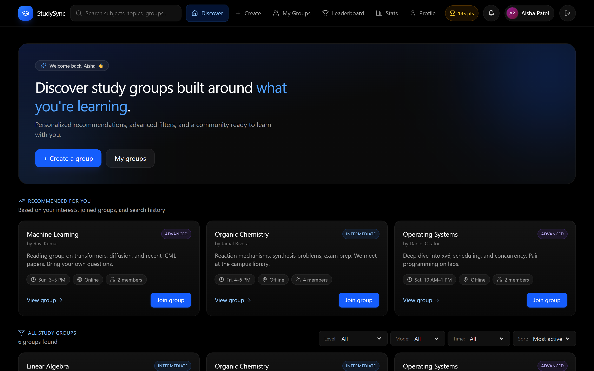
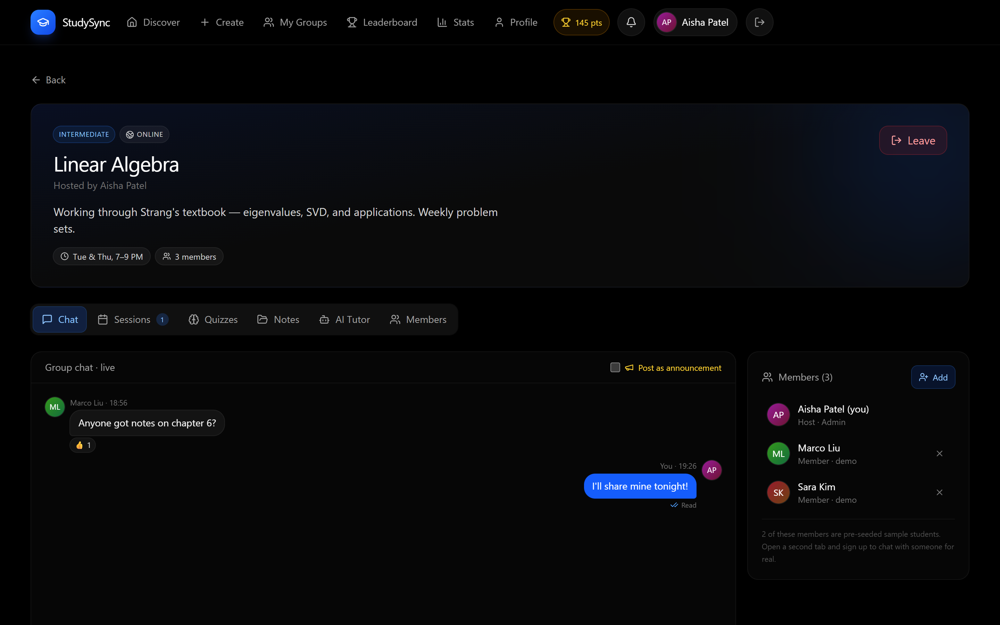
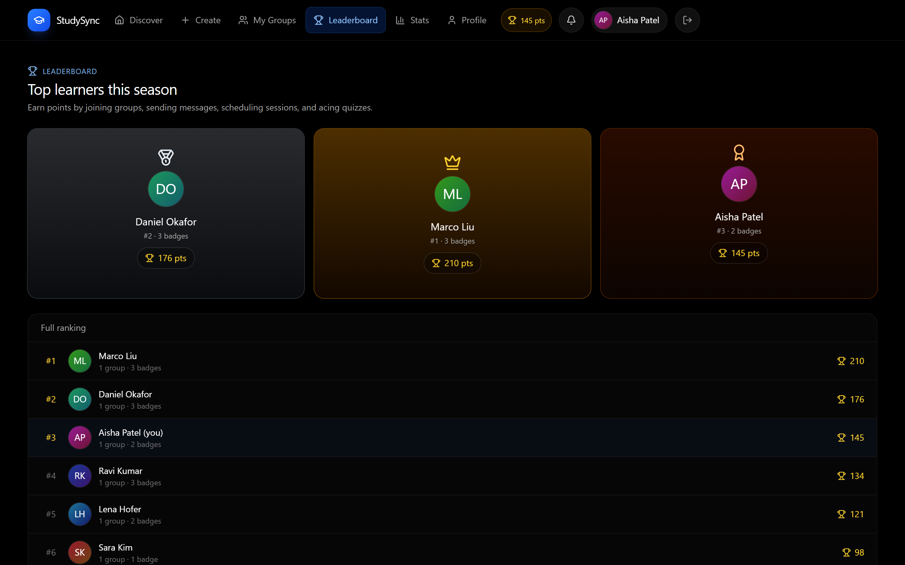
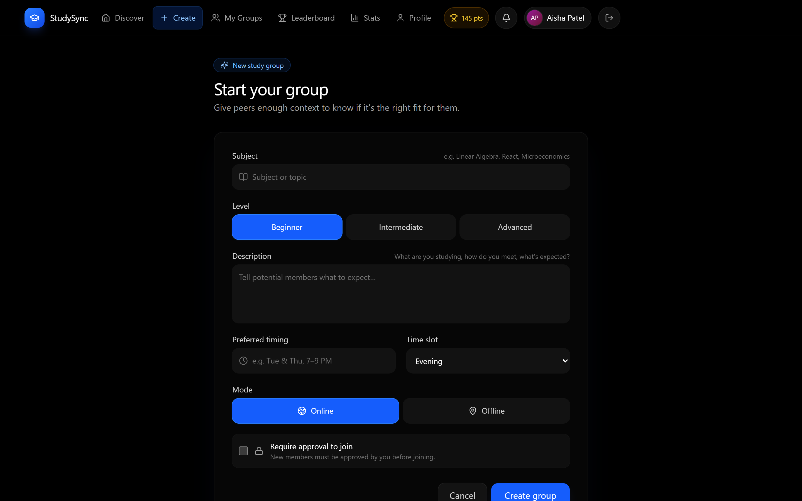

# StudySync

**Find a study group that actually fits — by subject, skill level, and when you're free. Then chat, share notes, schedule sessions and run quizzes together.**

A React + TypeScript app with no server, no database and no build-time magic. Everything runs in your browser, and it works from a clean `git clone` in about 30 seconds.

[](https://github.com/Satvik-git20/study-group-finder/actions/workflows/ci.yml)
[](https://www.typescriptlang.org/)
[](https://vite.dev/)
[](https://tailwindcss.com/)

---

## The problem it solves

Studying alone is miserable and studying with the wrong people is worse. Finding
a group that meets when you're free, at your level, on a subject you actually
care about — that's the hard part. Most study-group apps make you do the sorting
by hand, or hide everything behind a signup wall before you've seen anything.

StudySync lets you browse and filter before you commit, and it puts the
collaboration tools in one place: chat with reactions and file sharing,
scheduled sessions with reminders, self-authored quizzes, and a lightweight
points system that rewards turning up rather than lurking.

## Screenshots

| | |
| --- | --- |
| **Discover** — recommendations ranked from your interests and search history, plus filters for level, mode and time slot.<br> | **Group chat** — reactions, read receipts, host-only announcements and attachments. Members who are sample data are labelled as such.<br> |
| **Leaderboard** — points and badges earned from joining, posting, scheduling and quiz scores.<br> | **Create a group** — level, online or offline, time slot, and whether joining needs approval.<br> |

## Two tabs is a real multi-user session

This is the part worth knowing about.

There's no server, so how does chat work? `localStorage` is shared between tabs
of the same origin, and this app broadcasts changes over a `BroadcastChannel`.
So two tabs genuinely are two users:

1. Open the app in two tabs.
2. Sign up as a different student in each.
3. Create a group in tab A and request to join it from tab B.

Messages, join requests, approvals, notifications and points all propagate live
between the tabs, and a green dot marks who is online. It's a real
collaborative session with no infrastructure.

The presence indicator reports other tabs of *this* app, not people on the
internet. If that distinction isn't clear enough, the member list labels every
pre-seeded sample student as `demo` in plain text.

## Try it in 30 seconds

```bash
git clone https://github.com/Satvik-git20/study-group-finder.git
cd study-group-finder
pnpm install
pnpm dev
```

Open the printed URL and click **"Explore with the demo account"** to land in a
populated app immediately. Requires **Node.js 20+** and [pnpm](https://pnpm.io).

Prefer a hosted copy? See [Deployment](#deployment).

## What it does

| Area | Details |
| --- | --- |
| **Discovery** | Filter by skill level, online/offline, and time slot. Debounced search with history. |
| **Recommendations** | Groups ranked against your profile subjects, the groups you've joined, and your recent searches. |
| **Groups** | Create groups, join open ones instantly, or request to join approval-gated ones. Hosts approve, reject, add and remove members. |
| **Chat** | Reactions, file and image attachments, host-only announcements, read receipts, and auto-scroll that leaves you alone when you're reading history. |
| **Sessions** | Schedule sessions with date, time and duration; every member is notified. |
| **Quizzes** | Members author quizzes; attempts are scored and tracked per user. Points are awarded once per quiz. |
| **Notes** | Every attachment shared in chat, collected into one browsable, downloadable library. |
| **Gamification** | Points for joining, posting, scheduling and answering correctly. Six badges unlock automatically. |
| **Analytics** | Per-user activity breakdown and a cross-user leaderboard. |
| **Notifications** | In-app centre for messages, join requests, approvals, sessions, announcements and badges. |

## How it's built

- **React 18 + TypeScript in strict mode**, with `noUncheckedIndexedAccess` on.
- **Vite 6** and **Tailwind CSS v4** (via the Vite plugin, no PostCSS config).
- **react-router 7** for real URLs — deep links like `/groups/g1` work, and so
  does the back button.
- **State in a single `useSyncExternalStore` store.** One subscription for the
  whole app, rather than one per component re-parsing `localStorage` on every
  render.
- **31+ unit tests** on the store, where the interesting logic lives.

Total runtime dependencies: **13**. That's not an accident — the dependency list
was audited and cut from 50.

## Commands

Run from the repo root:

| Command | Does |
| --- | --- |
| `pnpm dev` | Start the dev server |
| `pnpm typecheck` | `tsc --noEmit`, strict |
| `pnpm lint` | ESLint, including the React hooks rules |
| `pnpm test` | Vitest |
| `pnpm build` | Typecheck, then build to `apps/web/dist` |
| `pnpm preview` | Serve the production build |
| `pnpm check` | typecheck + lint + test |
| `pnpm --filter studysync capture` | Regenerate the screenshots in this README |

CI runs typecheck, lint, test and build on every push.

## Project layout

```
apps/web/
  src/app/
    App.tsx            route table
    types.ts           domain types
    useSearchQuery.ts  ?q= search-param hook
    components/        screens and panels
    store/
      core.ts          cached state + the useSyncExternalStore subscription
      actions.ts       all mutations (auth, groups, messages, quizzes, points)
      channel.ts       BroadcastChannel sync and tab presence
      storage.ts       localStorage adapter with quota handling
      seed.ts          sample groups
      store.test.ts    unit tests
  scripts/
    capture-screenshots.mjs
docs/screenshots/
netlify.toml
```

## Deployment

`pnpm build` produces a static bundle in `apps/web/dist`, hostable anywhere.

**Client-side routing means the host must rewrite all unmatched paths to
`/index.html`**, otherwise a hard refresh on `/groups/g1` returns 404. A
`netlify.toml` is included that does this, along with immutable caching for
hashed assets. For nginx, use `try_files $uri /index.html;`.

> If you fork this and connect it to Netlify, the button below starts working.
> It does nothing until the repository is linked to a Netlify account.

<a href="https://app.netlify.com/start/deploy?repository=https://github.com/Satvik-git20/study-group-finder"></a>

## Known limitations

Stated up front, because they'd otherwise waste your time:

- **No server.** Accounts, groups and messages are per-browser. Clearing site
  data deletes everything irrecoverably, and a different browser or a private
  window is a completely separate instance.
- **Authentication is a simulation, not security.** Passwords are stored in
  plain text in `localStorage` and compared with a string check. The demo
  button is not connected to any identity provider. **Don't enter a real
  password.** See [SECURITY.md](SECURITY.md) for the full threat model.
- **Attachments are capped at 256 KB per file** and stored inline as base64.
  This is a deliberate trade-off to stay inside the ~5 MB `localStorage` quota.
  Moving to IndexedDB would remove the cap and is the top item in
  [CONTRIBUTING.md](CONTRIBUTING.md#what-id-love-help-with).
- **The "AI Tutor" tab is a demo.** It matches keywords and returns canned
  responses. It is labelled as such in the UI. It is not a language model.
- **Dark mode only.** The design is built on near-black, so light mode was
  removed rather than shipped half-working.
- Pre-seeded group members are sample data and will never reply.

## Contributing

Issues, ideas and pull requests are all welcome — see
**[CONTRIBUTING.md](CONTRIBUTING.md)** for setup, conventions, and a list of the
areas I most want help with.

## Project status

Actively worked on. The `v0.1.0` release notes are in
[RELEASE_NOTES.md](RELEASE_NOTES.md).

If this was useful to you, a star genuinely helps other people find it.
